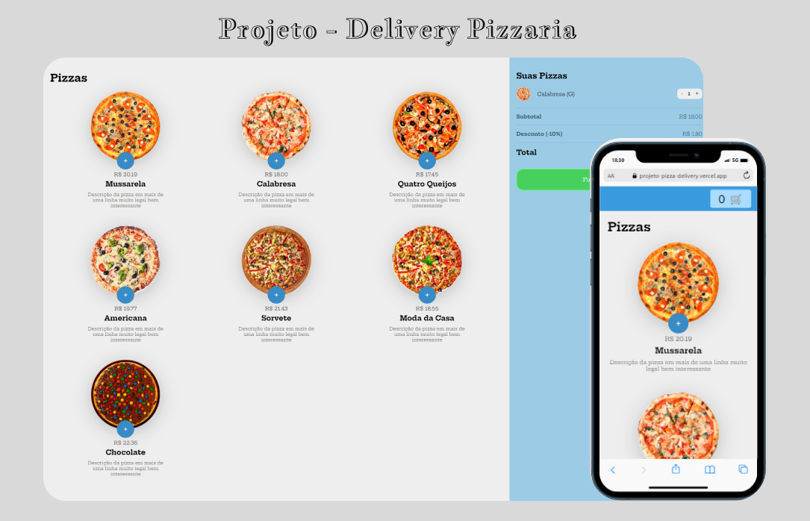

<h1 align="center"> Delivery Pizzaria</h1>

Projeto criado na aula de JavaScript, promovido pela B7Web para ensino de tecnologias WEB.

  <a href="#-tecnologias">Tecnologias</a>&nbsp;&nbsp;&nbsp;|&nbsp;&nbsp;&nbsp;
  <a href="#-projeto">Projeto</a>&nbsp;&nbsp;

 

  

## 🚀 Tecnologias

Esse projeto foi desenvolvido com as seguintes tecnologias:

- HTML e CSS
- JavaScript
- Git e Github
 

## 💻 Projeto

Essa aplicação tem como propósito, realizar pedidos de pizzas realizado de onde o cliente estiver, facilitando a vida do cliente.

[🔗 Clique aqui para acessar](https://projeto-pizza-delivery.vercel.app/)

---

Feito com ♥ by Daniel Kyochi 🌍

